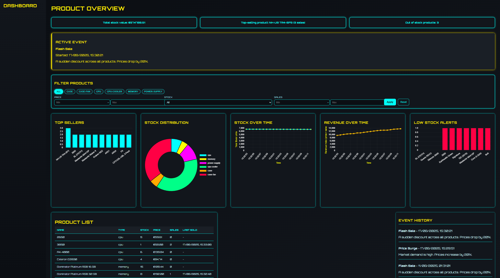

[](https://classroom.github.com/a/BhMy8Rjk)

# PC Component Economy Simulator

## Project Overview

This Node.js project simulates a dynamic PC component marketplace. Products like CPUs, GPUs, and SSDs are tracked over time as they go in and out of stock, with fluctuating prices influenced by demand and special events (e.g., hype waves). The app includes real-time updates using WebSockets and a browser-based dashboard to visualize the current market state.

It also features seed scripts for testing, JSON-based data loading, and mock economic behaviors like purchase surges and stock depletion.



## Key features:
- Demand-based price fluctuations
- Event-driven demand spikes (like hype waves)
- WebSocket-powered frontend updates
- JSON/Script seeding for test data
- Real-time stock and sales simulation

## Built With

* [Node.js](https://nodejs.org/)
* [Express.js](https://expressjs.com/)
* [MongoDB + Mongoose](https://mongoosejs.com/)
* [Socket.IO](https://socket.io/)
* [Chart.js](https://www.chartjs.org/) (for frontend dashboard)

## Getting Started

### Prerequisites

- Node.js (v18+)
- MongoDB (local or remote)
- npm

### Installation

1. Clone the repo
   ```sh
   git clone https://github.com/your_username/pc-economy-sim.git
   cd pc-economy-sim
   ```

2. Install dependencies
   ```sh
   npm install
   ```

3. Create a `.env` file and configure:
   ```env
   MONGO_URI=mongodb://localhost:27017/pcsim
   PORT=5000
   ```

4. Seed the database
   ```sh
   node seed.js
   # or
   node seedFromJson.js
   ```

5. Start the server
   ```sh
   npm start
   ```

## Usage

- Start the server.
- Open the dashboard in your browser.
- Watch real-time changes as products are bought, sold, and affected by events.
- Toggle or simulate events via the server logic to observe pricing behavior.

## Roadmap

- [x] Stock fluctuation simulation
- [x] Demand-based pricing
- [x] Hype wave events
- [x] WebSocket updates
- [x] Product price history
- [x] PC parts Rest API
- [x] Dashboard data updates
- What's next:
- [ ] User Accounts & Sessions
- [ ] Admin Dashboard Controls
- [ ] Predictive Analytics
- [ ] ...

## Development Notes

- Products are updated by the simulation engine in timed ticks
- Events (e.g. hype waves) temporarily boost demand
- WebSockets broadcast state changes to connected dashboards

## Contributing

1. Fork the repo
2. Create a branch: `git checkout -b feature/my-feature`
3. Commit your changes: `git commit -m 'Add my feature'`
4. Push to your fork: `git push origin feature/my-feature`
5. Open a pull request

## License

Distributed under the MIT License. See `LICENSE.md` for more information.


## Contact

Safwane Ahdi – [Email me](mailto:safwane.ahdi@student.ehb.be)

Project Link: [https://github.com/EHB-MCT/remedial-assignment-safwane-ahdi](https://github.com/EHB-MCT/remedial-assignment-safwane-ahdi)


## Acknowledgments

- [Socket.IO Docs](https://socket.io/docs)
- [Chart.js Docs](https://www.chartjs.org/docs/)
- [Best README Template](https://github.com/othneildrew/Best-README-Template)
- [ChatGPT](https://chatgpt.com/)

## References

- AI Assistance: Used ChatGPT for coding assistance, debugging during development, coding convenience, and assistance with exploring programming languages and frameworks not yet learned.
- [Python Proxy](https://chatgpt.com/share/68a06ebf-a9b4-8001-97c7-74bf386f303b)
- [Engine Optimization](https://chatgpt.com/share/68a06fd2-23bc-8001-81cb-b5f6581942d9)
- [Dashboard improvements](https://chatgpt.com/share/68a07021-1604-8001-be04-59775d142c1b)